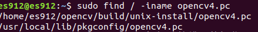
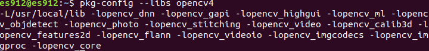

ONNX -> ONNX Runtime
======

### 下載ONNX Runtime

+ [ONNX Runtime官方參考資料](https://github.com/Microsoft/onnxruntime)

+ 下載ONNX Runtime事前準備(如果有安裝過的可以跳過)

```
$ sudo apt-get install python3
$ sudo apt-get install python3-pip
$ pip3 install --upgrade pip
$ pip3 install --upgrade setuptools
$ pip3 install --upgrade wheel
$ pip3 install numpy
```
+ 安裝Cmake 3.24.0

```
$ sudo wget https://cmake.org/files/v3.24/cmake-3.24.0.tar.gz
$ sudo tar -zxvf cmake-3.24.0.tar.gz
$ cd cmake-3.24.0
$ sudo apt-get -y install libssl-dev
$ sudo ./configure
$ sudo make -j8 
$ sudo make install
$ cmake --version
```


+ 安裝ONNX Runtime

```
$ git clone --recursive https://github.com/Microsoft/onnxruntime
$ cd onnxruntime
$ git checkout v1.10.0(切換分支)
$ ./build.sh --config Release --build_shared_lib --parallel(這邊下載的是CPU版本)

如果下載中出現報錯換打這個指令

$ ./build.sh --config Release --build_wheel --update --build
```

### 安裝OpenCV 4.5.0事前準備

+ 安裝g++、Cmake、make、unzip

    + 不知道自己有沒有安裝過可以用**whereis**來查找
    
    ```
    $ whereis cmake
    $ whereis make
    ``` 

    + 沒下載的指令在下面
    
    ```
    $ sudo apt install -y g++
    $ sudo apt install -y cmake
    $ sudo apt install -y make
    $ sudo apt install -y wget unzip
    ```
###　安裝OpenCV

```
$ sudo apt-get install build-essential libgtk2.0-dev libgtk-3-dev libavcodec-dev libavformat-dev libjpeg-dev libswscale-dev libtiff5-dev
$ sudo apt install python3-dev python3-numpy
$ sudo apt install libgstreamer-plugins-base1.0-dev libgstreamer1.0-dev
$ sudo apt install libpng-dev libopenexr-dev libtiff-dev libwebp-dev
$ wget -O opencv.zip https://github.com/opencv/opencv/archive/4.5.0.zip
$ sudo tar -zxvf opencv-4.5.0.zip
```
+ 解壓縮後將檔名改成OpenCV

```
$ cd opencv
$ mkdir build
$ cd build
```

+ 用Cmake配置OpenCV

```
$ cmake -D CMAKE_BUILD_TYPE=Release -D OPENCV_GENERATE_PKGCONFIG=YES ..
$ make -j4(要一段時間)
$ sudo make install
```

+ 安裝完後默認環境為

    + /usr/local/bin - executable files
    + /usr/local/lib - libraries (.so)
    + /usr/local/cmake/opencv4 - cmake package
    + /usr/local/include/opencv4 - headers
    + /usr/local/share/opencv4 - other files 

+ 配置OpenCV環境，先找到opencv4.pc這個文件，默認路徑：/usr/local/lib/pkgconfig/opencv4.pc，也可以用指令搜尋

```
$ sudo find / -iname opencv4.pc
```


+ 加入PKG_CONFIG_PATH

```
$ sudo vim /etc/profile.d/pkgconfig.sh

export PKG_CONFIG_PATH=/usr/local/lib/pkgconfig:$PKG_CONFIG_PATH(加入後:wq離開)

$ source /etc/profile
$ pkg-config --libs opencv4
```


```
$ sudo vim /etc/ld.so.conf.d/opencv4.conf

/usr/local/lib(加入後:wq離開)

$ sudo ldconfig
```

### 測試OpenCV有沒有安裝成功

```
$ cd opencv/samples/cpp/example_cmake
$ cmake .
$ make
$ ./opencv_example
```

+ 攝影機有成功啟動代表安裝成功


