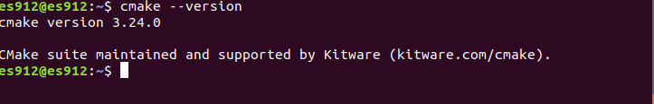

ONNX -> ONNX Runtime
======

### 下載ONNX Runtime

+ [ONNX Runtime官方參考資料](https://github.com/Microsoft/onnxruntime)

+ 下載ONNX Runtime事前準備(如果有安裝過的可以跳過)

```
$ sudo apt-get install python3
$ sudo apt-get install python3-pip
$ pip3 install --upgrade pip
$ pip3 install --upgrade setuptools
$ pip3 install --upgrade wheel
$ pip3 install numpy
```

+ 安裝Cmake 3.24.0


```

```
+ gcc版本7.5

+ 
```
$ git clone --recursive https://github.com/Microsoft/onnxruntime
$ cd onnxruntime
$ git checkout v1.10.0(切換分支)

```